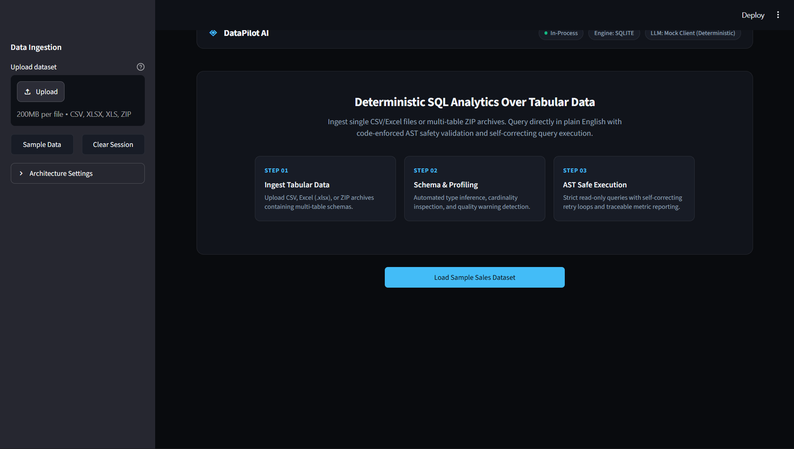
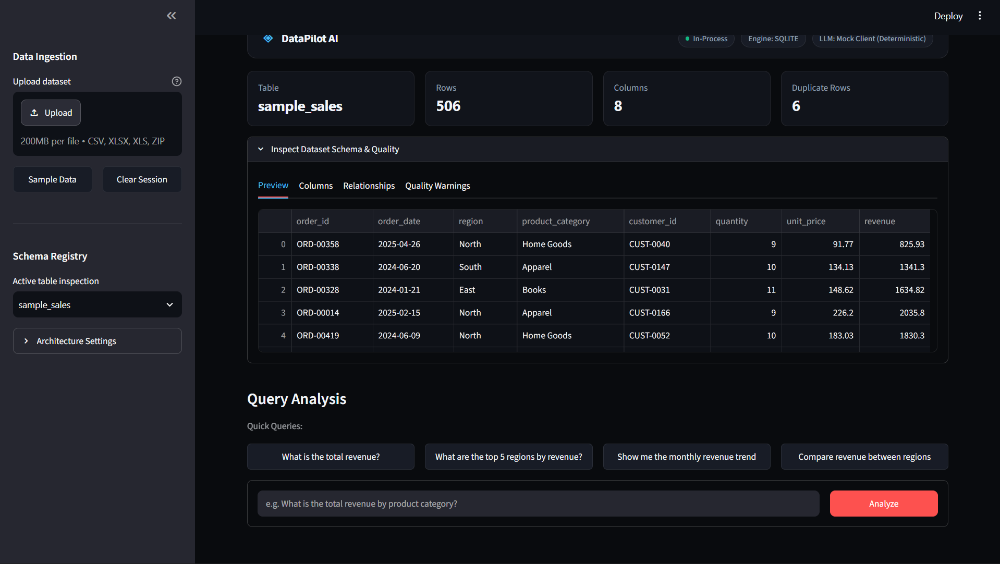
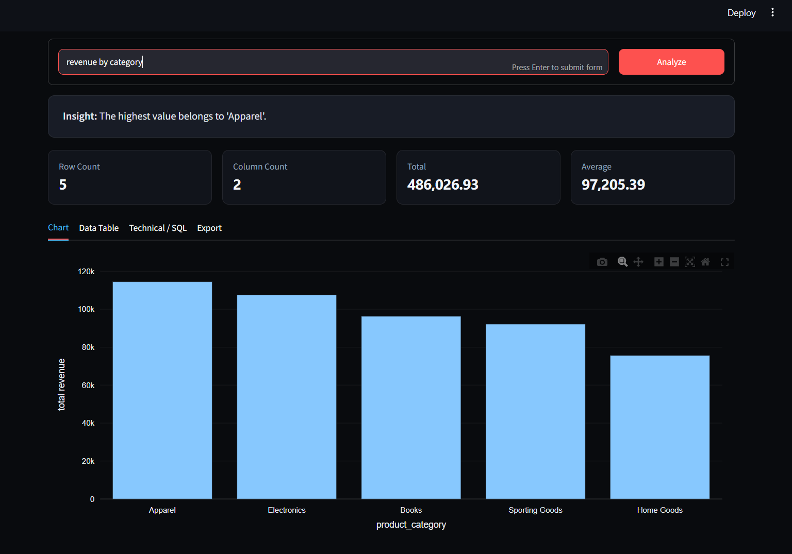
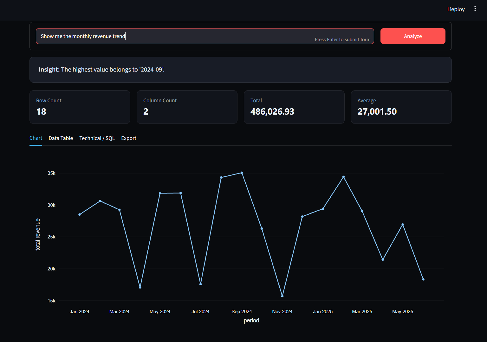
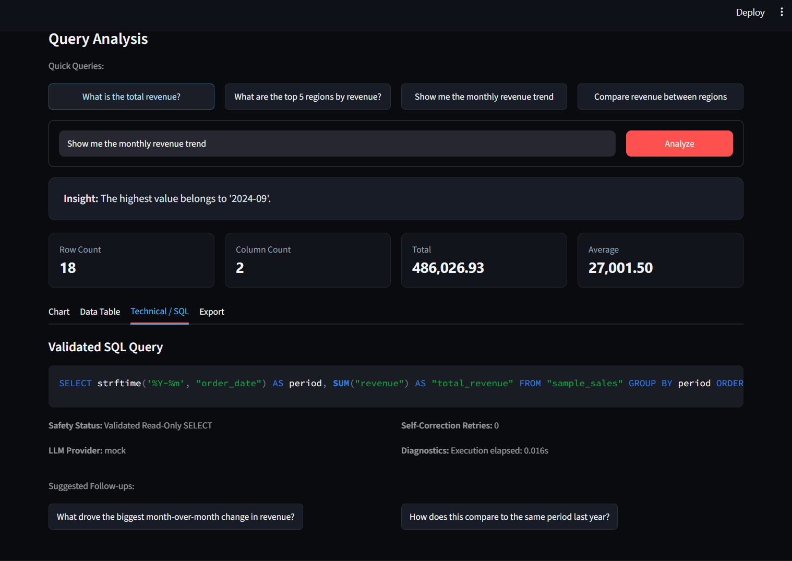

# DataPilot AI -- Intelligent Business Analytics

Ask a business question in plain English about a CSV or Excel file you
upload, and get back the SQL that answers it, computed metrics, a chart,
plain-language insight, and an exportable report -- with a deterministic
safety layer that never executes anything but a validated, read-only
`SELECT`, and that asks for clarification instead of guessing when a
question is genuinely ambiguous.

> (MIT License). See [`NOTICE.md`](NOTICE.md) and

## What problem this solves

A basic "upload a file and chat with an AI about it" workflow has two
recurring failure modes: it either (a) lets the model write and run
arbitrary SQL against your data with no safety net, or (b) has the model
eyeball a sample of the data and free-associate an answer with no way to
check where the numbers came from. DataPilot AI is built around closing
both gaps:

- **Every numeric answer is traceable to an executed, validated SQL query**
  you can inspect -- never a number the model "read off" the data.
- **SQL safety is enforced in code** (`app/agents/sql_validator.py`), not
  by asking the model nicely. Malicious or destructive text has nowhere to
  go: the SQL that actually runs is generated from a small structured plan,
  templated, and then independently validated before execution.
- **Genuinely ambiguous questions get a clarification request, not a
  silent guess.** "What's the best-selling product?" could mean highest
  revenue or highest unit sales -- the app says so instead of picking one.

## Table of contents

- [Visual Tour & Walkthrough](#visual-tour--walkthrough)
- [Features](#features)
- [Architecture](#architecture)
- [Tech stack](#tech-stack)
- [Project structure](#project-structure)
- [Installation](#installation)
- [Environment variables](#environment-variables)
- [Running it](#running-it)
- [How the API and frontend relate](#how-the-api-and-frontend-relate)
- [Sample questions](#sample-questions)
- [Testing](#testing)
- [Evaluation](#evaluation)
- [What has and hasn't been executed](#what-has-and-hasnt-been-executed-in-development)
- [Structured plan validation](#structured-plan-validation)
- [Scope classification](#scope-classification)
- [Database, thread, and session reliability](#database-thread-and-session-reliability)
- [RAG / retrieval layer](#rag--retrieval-layer)
- [Multi-user and session isolation](#multi-user-and-session-isolation)
- [Security considerations](#security-considerations)
- [Known limitations](#known-limitations)
- [Future improvements](#future-improvements)
- [How this differs from the reference project](#how-this-differs-from-the-reference-project)
- [Credits](#credits)

## Features

**Implemented and verified** (see [Testing](#testing) / [Evaluation](#evaluation) for how):

- CSV, **Excel (.xlsx)**, and **ZIP archive (multi-table)** upload -- with automatic schema discovery and relationship detection across tables.
- **Hermes-inspired minimal dark SaaS interface**: clean typography, card surfaces, responsive layout, table registry, and dark Plotly visual charts.
- **Self-correcting SQL execution loop**: if an executable query encounters a runtime database error, context is fed back to the LLM for up to 2 safe retries -- with complete re-validation on every step.
- **Groq Cloud API support**: native high-speed cloud inference using `llama-3.3-70b-versatile` via `LLM_PROVIDER=groq` (alongside Anthropic, Ollama, and deterministic Mock mode).
- **Unified Frontend/Backend Client**: Streamlit can run zero-config in-process or communicate over HTTP with the FastAPI service via `DataPilotApiClient`.
- **Scope classification before planning**: every question is first
  classified `in_scope | ambiguous | out_of_scope | unsafe` -- an
  unrelated question ("what is the meaning of life?") gets an honest,
  friendly response instead of a misleading internal error; a destructive
  or prompt-injection request is refused outright with a clear "read-only"
  explanation. See [Scope classification](#scope-classification).
- Data profiling before analysis: row/column counts, per-column types,
  missing values, duplicate rows, invalid numeric strings, unparseable
  dates, high-cardinality categorical columns.
- Structured, **validated** analysis plan (intent, grouping column, metric
  column, aggregation, filters, sort direction, limit, date column, time
  granularity, chart type, clarification flag) generated before any SQL --
  see [Structured plan validation](#structured-plan-validation).
- **A real retrieval (RAG) step**: a business glossary and validated
  question-pattern library, retrieved via schema-aware keyword/concept
  matching and genuinely injected into the LLM prompt (not just present in
  the codebase) -- see [RAG / retrieval layer](#rag--retrieval-layer).
- **Synonym-aware, plural-aware schema matching**: recognizes
  `item_name`/`product_name` as "product", `sales_amount`/`total_sales` as
  "revenue", `transaction_date`/`purchase_date` as "date", and matches
  "categories"/"products" in a question to singular column names like
  `product_category` -- not hardcoded to one dataset's exact column names
  or exact word forms (`app/data/column_matcher.py`).
- 12 classified intents: aggregation, ranking (with limit + sort
  direction), grouped comparison, time-series trend, percentage change,
  descriptive statistics, missing-data analysis, duplicate analysis,
  trend-by-dimension (e.g. "which products are declining"),
  **anomaly detection** (flags rows more than 2 standard deviations from a
  column's mean, using statistics from the already-computed data profile
  rather than asking the LLM to invent them -- SQLite has no built-in
  STDDEV), and unsupported/ambiguous handling.
- **Ambiguity detection**: a question with more than one plausible metric
  interpretation (e.g. "best-selling"), or genuinely vague phrasing
  ("how are sales doing?"), triggers a clarification request listing real
  columns from the loaded schema -- instead of a silent guess.
- SQL safety enforced in code, independent of the LLM's behavior,
  including CTE-aware validation -- see [Security considerations](#security-considerations).
- **Thread-safe, session-isolated data layer**: a file-backed SQLite
  database per session (Streamlit session or API session), proven safe
  under real concurrent access -- see [Database, thread, and session reliability](#database-thread-and-session-reliability).
- Explainable results: every answer bundles the SQL used, computed
  metrics (named after the actual metric, e.g. `total_revenue` -- never a
  hardcoded generic column), an insight grounded only in those metrics,
  data quality warnings, and follow-up questions.
- Markdown and PDF report export.
- Provider-agnostic LLM layer: deterministic offline mock (default, used
  by tests) / Groq API / Anthropic API / local Ollama model, swapped with one
  environment variable. The system never claims a live model was used when
  running in mock mode (`AnalysisResult.llm_provider`).
- A real evaluation suite across **two datasets with different schemas**:
  65 cases (business questions, phrasing variations of the same question,
  scope-classification accuracy, safety probes, consistency checks), run
  against the actual orchestrator and reported with an honest pass rate --
  see [Evaluation](#evaluation).

**Written but not executable in this project's dev sandbox** (no network
access to install `fastapi`/`streamlit`/`plotly`/`duckdb`/`pydantic`/`ruff`
there -- see [What has and hasn't been executed](#what-has-and-hasnt-been-executed-in-development)):
the FastAPI backend (though its session-isolation *logic* is tested
separately via `app/api/session_manager.py`), the Streamlit UI, Plotly
charts, live Anthropic API calls, the DuckDB backend option, and
pydantic-based HTTP validation. These are complete, syntax-checked code,
calling into a core that IS tested -- but verify them yourself with
`pip install -r requirements.txt` before presenting or relying on them.

## Visual Tour & Walkthrough

Below is an end-to-end visual walkthrough demonstrating the DataPilot AI application running in real-time, from startup and dataset ingestion to natural-language querying, interactive visualizations, and deterministic SQL execution auditability.

### 1. Main Dashboard & Workspace
When launching the application (`python -m streamlit run frontend/streamlit_app.py`), users are greeted by a sleek Hermes-inspired dark SaaS workspace featuring active session indicators, one-click demo data loaders, and an intuitive analytical prompt bar.


*Figure 1: Main DataPilot AI dashboard showcasing the dark-mode aesthetic, multi-provider model selector, and instant sample data actions.*

---

### 2. Automated Dataset Ingestion & Diagnostics
Loading or uploading data (CSV, XLSX, or ZIP archives) instantly triggers automatic schema profiling. The system extracts row counts, column types, missing value percentages, and renders an interactive data preview table.


*Figure 2: Dataset overview diagnostic card showing schema discovery, data quality health checks, and sample tabular preview.*

---

### 3. Natural-Language Business Analytics
Users can ask complex business questions in plain English (e.g. *"Which product categories generated the highest total revenue?"*). DataPilot AI validates the scope, executes safe read-only SQL, and computes exact metrics alongside structured textual summaries.


*Figure 3: Natural language query results answering revenue by product category with ranked figures and plain-language analytical insights.*

---

### 4. Dynamic Interactive Visualizations
Visual trends and comparisons (such as *"Show the monthly revenue trend."*) are automatically identified by the planning engine and plotted with responsive, interactive dark-themed Plotly charts.


*Figure 4: Automated time-series line chart rendering monthly revenue progression with interactive hover tooltips.*

---

### 5. Transparent SQL Generation & Audit Trail
Every calculation is 100% auditable. Users can expand the execution inspector to examine the exact generated SQL query, timing benchmarks, execution plan, and underlying raw result set.


*Figure 5: Inspectable, deterministic SQL query view with safety verification badge, row counts, and execution metrics.*

---

## Architecture

```
                    ┌─────────────────────────┐
                    │   Streamlit frontend      │   (in-process; talks
                    │  upload · ask · charts    │    directly to the
                    └────────────┬─────────────┘    orchestrator below --
                                 │                    does NOT call the
                                 │                    FastAPI backend)
                    ┌────────────▼─────────────┐
                    │       Orchestrator          │◄──── FastAPI backend
                    │ (app/agents/orchestrator)   │      (/upload, /query,
                    └───┬───────┬───────┬───────┘       /health) talks to
       ┌────────────────┘       │       └───────────┐   the SAME orchestrator
       ▼                        ▼                       ▼               class, over HTTP
┌─────────────────┐   ┌────────────────────┐  ┌────────────────────┐
│ AnalysisPlanner  │   │   SQLGenerator      │  │  SQL Validator      │
│ question+schema  │──►│  plan+schema→SQL     │─►│ deterministic,      │
│ → validated plan │   │                     │  │ schema/CTE-aware     │
└────────┬─────────┘   └─────────────────────┘  └──────────┬──────────┘
        │ (LLMClient: mock | anthropic | ollama)            │ safe SQL
        ▼                                                    ▼
┌─────────────────┐                               ┌─────────────────────┐
│  Data Profiler   │                               │ AnalyticalDatabase    │
│ (quality checks) │                               │ (SQLite, or DuckDB)   │
└─────────────────┘                               └──────────┬──────────┘
                                                                │ result rows
                                                                ▼
                                                ┌───────────────────────────┐
                                                │  Metrics (plan-driven      │
                                                │  metric_alias) + Insight   │
                                                │  + Chart + Report          │
                                                └───────────────────────────┘
```

Some intents (`missing_data`, `duplicate_analysis`, `descriptive_stats`)
skip the SQL path entirely -- the orchestrator answers them straight from
the already-computed data profile, since there's nothing to query for
those.

## Tech stack

| Layer | Technology | Status here |
|---|---|---|
| Frontend | Streamlit | written, untested (no network to install) |
| Backend API | FastAPI + Pydantic | written, untested (no network to install) |
| Analytical database | SQLite (default) or DuckDB (optional) | SQLite tested; DuckDB untested |
| Data loading | Pandas + openpyxl (Excel) | **tested** -- openpyxl is genuinely installed here |
| Data processing | Pandas + NumPy | tested |
| Visualization | Plotly | written, untested |
| Reports | Markdown + ReportLab (PDF) | tested |
| LLM | mock (tested) / Anthropic API (untested) / Ollama (untested) | see above |
| Plan validation | stdlib dataclass + hand-written validator (pydantic mirror at the API boundary) | tested (core); untested (API mirror) |
| Testing | stdlib `unittest` (pytest-compatible) | tested |
| Lint | Ruff (configured, not runnable here -- no network) | not verified |
| Containers | Docker + Docker Compose | written, untested |
| CI | GitHub Actions | written, untested |

## Project structure

```
datapilot-ai/
├── app/
│   ├── core/
│   │   ├── config.py              # environment-driven settings (dataclass)
│   │   └── logging_config.py      # centralized stdlib logging setup
│   ├── data/
│   │   ├── database.py            # SQLite/DuckDB adapter: load, describe schema, query
│   │   ├── loader.py              # shared CSV/XLSX/XLS loading (tested incl. Excel)
│   │   ├── column_matcher.py      # synonym-aware concept matching, limit/sort parsing
│   │   └── profiler.py            # data-quality profiling
│   ├── llm/
│   │   ├── base.py                # LLMClient interface
│   │   ├── mock_client.py         # deterministic offline client used by tests + eval
│   │   ├── anthropic_client.py    # real Anthropic + Ollama clients
│   │   ├── factory.py             # picks a client based on LLM_PROVIDER
│   │   └── prompts.py             # prompt templates
│   ├── agents/
│   │   ├── planner.py             # question+schema -> validated AnalysisPlan
│   │   ├── sql_generator.py       # AnalysisPlan -> SQL text (via LLM)
│   │   ├── sql_validator.py       # deterministic, CTE-aware SQL safety validation
│   │   └── orchestrator.py        # wires the whole pipeline together
│   ├── analytics/metrics.py       # plan-driven metric computation (no hardcoded column names)
│   ├── visualization/charts.py    # Plotly chart construction
│   ├── reports/{markdown,pdf}_report.py
│   └── api/
│       ├── main.py                # FastAPI app: /upload, /query, /health
│       └── schemas.py             # Pydantic request/response + plan mirror
├── frontend/streamlit_app.py      # Streamlit dashboard
├── data/
│   ├── sample_sales.csv           # bundled sample #1 (region/product_category/revenue schema)
│   └── sample_ecommerce.csv       # bundled sample #2 -- deliberately different column names
├── tests/                         # 206 unit/integration tests
├── eval/
│   ├── benchmark.py                # 65 cases across both datasets + scope classification
│   └── run_eval.py                 # runs the benchmark, prints an honest pass rate
├── scripts/
│   ├── demo_cli.py                # dependency-light CLI demo (pandas/numpy/reportlab/openpyxl)
│   ├── run_all.sh / run_all.ps1   # optional single-command dev launcher
├── Dockerfile / docker-compose.yml
├── .github/workflows/ci.yml
└── CHANGELOG.md                   # what changed and why, across improvement rounds
```

## Installation

**macOS / Linux:**
```bash
git clone <this-repo-url> datapilot-ai
cd datapilot-ai
python -m venv .venv
source .venv/bin/activate
pip install -r requirements.txt
cp .env.example .env
```

**Windows (PowerShell):**
```powershell
git clone <this-repo-url> datapilot-ai
cd datapilot-ai
python -m venv .venv
.venv\Scripts\Activate.ps1
pip install -r requirements.txt
Copy-Item .env.example .env
```

If PowerShell blocks the activation script, run once (as the current user):
```powershell
Set-ExecutionPolicy -Scope CurrentUser RemoteSigned
```

**Windows (Command Prompt / CMD):**
```cmd
git clone <this-repo-url> datapilot-ai
cd datapilot-ai
python -m venv .venv
.venv\Scripts\activate.bat
pip install -r requirements.txt
copy .env.example .env
```

## Environment variables

All variables have safe defaults (see `app/core/config.py`) -- the app runs
out of the box with **zero API keys** using `LLM_PROVIDER=mock`.

| Variable | Default | Notes |
|---|---|---|
| `LLM_PROVIDER` | `mock` | `mock` \| `groq` \| `anthropic` \| `ollama` |
| `GROQ_API_KEY` | (empty) | required if `LLM_PROVIDER=groq` (high-speed Llama 3 cloud inference). See [`docs/GROQ_SETUP.md`](docs/GROQ_SETUP.md). |
| `ANTHROPIC_API_KEY` | (empty) | required only if `LLM_PROVIDER=anthropic`; never hardcode this -- it's read from the environment. Missing it raises a clear `ValueError` at startup, not a silent failure. |
| `OLLAMA_BASE_URL` | `http://localhost:11434` | used only if `LLM_PROVIDER=ollama` |
| `LLM_MODEL` | `llama-3.3-70b-versatile` | model name passed to whichever provider is selected (`llama-3.3-70b-versatile` for Groq, `claude-sonnet-4-6` for Anthropic) |
| `API_BASE_URL` | (empty / none) | optional: if set (e.g. `http://localhost:8000`), Streamlit frontend operates as an HTTP client connecting to FastAPI |
| `DATABASE_BACKEND` | `sqlite` | `sqlite` (tested) \| `duckdb` (untested here, requires `pip install duckdb`) |
| `DATABASE_PATH` | `data/datapilot.db` | ignored by the session-based paths (Streamlit/API), which each get their own auto-generated temp file -- see `AnalyticalDatabase.create_session_database()`; still used by the plain `:memory:` constructor path (tests/eval/CLI) |
| `MAX_RESULT_ROWS` | `1000` | hard cap enforced by the SQL validator, not just a suggestion |
| `QUERY_TIMEOUT_SECONDS` | `10` | currently informational (SQLite queries here are not long-running); wire into a real timeout if you swap in a slower backend |
| `MAX_UPLOAD_MB` | `50` | enforced by `POST /upload` (413 response if exceeded) |
| `SESSION_TTL_MINUTES` | `120` | how long an idle API session (see `app/api/session_manager.py`) stays alive before being pruned |
| `LOG_LEVEL` | `INFO` | passed to `app/core/logging_config.py` |

## Running it

**Backend API** (default port **8000**):
```bash
uvicorn app.api.main:app --reload
# -> http://localhost:8000/docs
```

**Frontend** (default port **8501**, in a second terminal):
```bash
streamlit run frontend/streamlit_app.py
# -> http://localhost:8501
```

**Both with one command** (starts the API in the background, then the
frontend in the foreground; Ctrl+C stops both):
```bash
bash scripts/run_all.sh          # macOS/Linux
powershell scripts/run_all.ps1   # Windows
```

**Docker (both services):**
```bash
docker-compose up --build
```

**No-install CLI demo** (only needs pandas/numpy/reportlab/openpyxl --
useful for a quick sanity check or an interview walkthrough; supports
`.csv`, `.xlsx`, and `.xls`):
```bash
PYTHONPATH=. python3 scripts/demo_cli.py "What is the total revenue by region?"
PYTHONPATH=. python3 scripts/demo_cli.py --file data/sample_ecommerce.csv "Rank items by sales amount"
```

> **Windows note:** commands throughout this README use `python3` (macOS/Linux
> convention). On Windows, use `python` instead, and set `PYTHONPATH` with
> `set PYTHONPATH=.` (CMD) or `$env:PYTHONPATH="."` (PowerShell) before a
> command, e.g. (CMD):
> ```cmd
> set PYTHONPATH=.
> python scripts\demo_cli.py "What is the total revenue by region?"
> ```

## How the API and frontend relate

- **They are independent processes that do NOT need each other.** The
  Streamlit app imports and calls the orchestrator directly, in-process --
  it does not make HTTP requests to the FastAPI backend. You can run just
  `streamlit run frontend/streamlit_app.py` with no backend running at all.
- The FastAPI backend exists as a separate, stateless-per-process HTTP
  interface to the *same* core, for programmatic/API consumers.
- **If the backend is unavailable**, the Streamlit app is unaffected (see
  above). If you're calling the API directly and it's down, requests will
  simply fail to connect -- there is currently no separate "backend
  unavailable" UI state in Streamlit, because it never depends on the
  backend being up. This is a known simplification if you later change the
  frontend to call the API over HTTP instead of in-process.
- **How uploaded files are handled**: each API client gets an isolated
  **session** (see [Database, thread, and session reliability](#database-thread-and-session-reliability)
  and [Multi-user and session isolation](#multi-user-and-session-isolation)
  below). `POST /upload` without a `session_id` creates a new session and
  returns its ID; pass that ID on every subsequent `POST /query`.
  Uploading again with the SAME `session_id` replaces that session's
  current table. The Streamlit app behaves the same way per browser
  session (via `st.session_state`, not the old global `st.cache_resource`
  -- see the linked section for why that distinction matters).
- **Resetting between datasets**: upload again with the same `session_id`
  (API), or click "Use sample sales dataset" / upload a new file again
  (Streamlit) -- the new file's table replaces the old one in that
  session's database.
- **Ending a session**: `DELETE /session/{session_id}` frees it
  immediately; otherwise it expires automatically after
  `SESSION_TTL_MINUTES` (default 120) of inactivity.
- **Health check**: `GET /health` reports the configured LLM provider,
  database backend, and the number of currently active sessions. Check
  this first if a client can't get a sensible response from `/query`.

## Sample questions

Against `data/sample_sales.csv` (columns: `order_date`, `region`,
`product_category`, `customer_id`, `quantity`, `unit_price`, `revenue`):

- "What is the total revenue?"
- "What are the top 5 regions by revenue?"
- "Which region has the highest revenue?"
- "Show me the monthly revenue trend"
- "Which product categories experienced declining sales?"
- "Compare revenue between regions"
- "How much data is missing?"
- "Are there any duplicate rows?"

Against `data/sample_ecommerce.csv` (deliberately different column names --
`transaction_date`, `sales_channel`, `item_name`, `units_sold`,
`sales_amount` -- to demonstrate synonym-based matching):

- "What is the total sales amount?"
- "Rank items by sales amount"
- "Which item sold the most units?"

Questions expected to be **refused rather than guessed at** (see
[Known limitations](#known-limitations)):

- "What is the total profit margin?" (no such column exists)
- "What is the best-selling product category?" (ambiguous: revenue or
  units? -- the app asks)
- "What is the meaning of life?" (unrelated to the dataset)

## Testing

```bash
pytest tests/ -v
```

As of this writing: **206 unit/integration tests, all passing.** Coverage
includes the profiler, the SQL validator (including CTE handling and
adversarial/injection cases), table-identifier injection resistance
(`tests/test_table_name_injection.py` -- proves a malicious "filename"
used as a table name cannot execute injected SQL), the column matcher,
the CSV/Excel loader (the Excel path is genuinely executed, not just
written -- `openpyxl` is installed in this dev environment), numeric-string
and currency-symbol coercion, zero-row/empty-result handling, plan
validation, metrics computation, report generation, and end-to-end
orchestrator integration tests (ranking with limits, sort direction,
ambiguity, the three profile-only intents, declining-sales-by-dimension,
an alternate-schema dataset, and a logging-output check).

## Evaluation

```bash
PYTHONPATH=. python3 eval/run_eval.py
```

As of this writing: **65/65 cases pass (100%)** across `data/sample_sales.csv`
and `data/sample_ecommerce.csv` combined -- aggregation, ranking (including
four phrasing variations of the same underlying ranking question), grouped
comparison, trend, percentage change, declining-sales-by-dimension, the
three profile-only intents, ambiguous questions, missing-column questions,
off-topic questions, a prompt-injection probe, a simulated malicious-LLM
probe, a consistency check, and an empty-dataset check.

**This 100% figure is a real, reproducible result of running the command
above against this exact code** -- it is not asserted in advance; the
script computes and prints it, and lists every individual case (with its
category) and, on any failure, exactly what didn't match. Two real bugs
were found and fixed via this exact process during round-2 development
(documented in `CHANGELOG.md`) -- the number was not always 100%, and this
README does not claim it is guaranteed to stay 100% as the codebase
changes; re-run it yourself to check.

## What has and hasn't been executed in development

This project was built and tested in a sandboxed environment with **no
network access**. `pandas`, `numpy`, `reportlab`, and (unexpectedly, but
genuinely) `openpyxl` were pre-installed there; `fastapi`, `streamlit`,
`plotly`, `duckdb`, `pydantic`, and `ruff` were not, and could not be
installed (no matching local package index). In the interest of never
claiming untested code works:

| Area | Status |
|---|---|
| `app/core`, `app/data` (including the Excel loader, numeric-string/currency coercion, CSV encoding fallback, and table-identifier injection resistance), `app/agents` (including `scope_classifier.py`, anomaly detection), `app/analytics`, `app/llm/mock_client.py`, `app/rag/*`, `app/reports/*`, `app/api/session_manager.py` | **Executed and tested** (206 unit/integration tests) and exercised end-to-end via `scripts/demo_cli.py` and the evaluation suite, against both bundled datasets. |
| `app/agents/sql_validator.py` | **Executed and tested directly**, including CTE handling and adversarial/injection cases. |
| `app/llm/anthropic_client.py` | Written to the real Anthropic SDK, syntax-checked, **not run against a live API** here. Test locally with a real key first. |
| `app/visualization/charts.py` (Plotly) | Written and syntax-checked; the *data shape* it consumes (plan-driven `metric_alias`) IS verified via the tested core, but Plotly rendering itself is **not executed** here (plotly not installable offline). |
| `app/api/main.py` / `app/api/schemas.py` (FastAPI + Pydantic) | Written and syntax-checked, **not started/hit with a real request** here. The orchestrator logic it calls into IS tested. The pydantic `AnalysisPlanModel` mirror is untested for the same reason. |
| `frontend/streamlit_app.py` | Written and syntax-checked, **not run with `streamlit run`** here. |
| `Dockerfile` / `docker-compose.yml` / CI workflow / `scripts/run_all.*` | Written to standard patterns, **not built/run** here (no Docker/network access). |
| `DATABASE_BACKEND=duckdb` | Written, **not exercised** here (`duckdb` not installed). `sqlite` (the default) is fully tested. |

**Before presenting or relying on this project, install the full
`requirements.txt` locally (with network access) and actually run**
`uvicorn app.api.main:app`, `streamlit run frontend/streamlit_app.py`, and
`docker-compose up --build`, confirming each behaves as documented.
Files in the "not executed" rows include an inline `NOTE ON TESTING`
comment saying the same thing.

## Structured plan validation

The spec for this project called for Pydantic (or an equivalent) to
validate the LLM's structured output. `pydantic` could not be installed in
this dev environment (no network access to PyPI or a local mirror). Rather
than silently skip validation, the tested core (`app/agents/planner.py`)
implements an equivalent contract by hand:

- `AnalysisPlan.validate()` checks that `intent` is one of a fixed set,
  `aggregation` is one of `sum`/`avg`/`min`/`max`/`count`/`None`,
  `sort_direction` is `asc`/`desc`/`None`, `chart_type` is a known type,
  `limit` (if set) is a positive integer, and that an answerable,
  non-profile-only plan actually names a metric column.
- Any plan failing this check is discarded and the question is answered
  with `intent="unsupported"` and a clear `clarification_needed` message --
  never silently coerced into "something plausible."
- This runs automatically inside `AnalysisPlanner.plan()`, so it's already
  exercised on every orchestrator test in `tests/test_orchestrator.py`,
  plus its own dedicated tests in `tests/test_plan_validation.py`.

Separately, `app/api/schemas.py` defines `AnalysisPlanModel`, a
field-for-field Pydantic mirror of `AnalysisPlan` with the same rules
expressed as `field_validator`s, for the HTTP boundary specifically. This
is a second, independent validation pass for API consumers -- not a
replacement for the one above, and (like the rest of the API layer)
untested here since `pydantic` isn't installed.

## Scope classification

Before any planning or SQL generation happens, `app/agents/scope_classifier.py`
runs a deterministic (no LLM call) check that classifies every question
into one of four scopes:

- **`in_scope`** -- proceeds to planning as normal.
- **`ambiguous`** -- valid-sounding but underspecified ("how are sales
  doing?", "what performed best?"), or on-topic but not specific enough
  for the planner to build a plan. Returns a clarification question
  listing real columns from the loaded schema.
- **`out_of_scope`** -- unrelated to the dataset entirely ("what is the
  meaning of life?", "write me a poem"). Returns a friendly redirect
  message, never the internal "could not map to a column" error this
  replaced.
- **`unsafe`** -- destructive intent or a prompt-injection-style
  instruction override ("drop the table", "ignore previous
  instructions..."). Refused outright with a clear "I only run read-only
  queries" message -- no SQL is generated at all for these.

The primary signal is **schema overlap** (does the question reference any
real column or known business concept in the loaded dataset?) rather than
a hardcoded list of "off-topic topics" -- this generalizes to any uploaded
dataset instead of only the bundled samples. A small, deliberately bounded
set of patterns layers on top for the `unsafe` and forced-`ambiguous`
cases (see the module docstring for the full reasoning on why those two
ARE hardcoded while the general out-of-scope detection isn't). Every
example question from this feature's original bug report is individually
unit-tested in `tests/test_scope_classifier.py`, plus end-to-end
regression tests in `tests/test_orchestrator.py` that reproduce the
original misleading-error bug and confirm it's fixed.

## Database, thread, and session reliability

`app/data/database.py`'s `AnalyticalDatabase` has two modes:

- **Default (`:memory:`, single held connection)** -- fast, zero temp
  files, but explicitly NOT thread-safe. Used by tests, the evaluation
  harness, and the CLI demo, none of which are multi-threaded.
- **`AnalyticalDatabase.create_session_database()`** -- a real,
  file-backed SQLite database (a unique temp file per call) where every
  operation opens and closes its own short-lived connection. This is what
  Streamlit and the API use. It's genuinely thread-safe: a connection
  never outlives the single operation that created it, so there is no
  connection object for two threads to race on.

This resolves a real, reproduced failure mode: a single long-lived
connection captured on one thread raises `sqlite3.ProgrammingError:
SQLite objects created in a thread can only be used in that same thread`
the moment it's touched from a different thread -- which Streamlit's
rerun model can trigger. `tests/test_database_thread_safety.py`
reproduces that exact error against the default mode first, then proves
`create_session_database()` doesn't exhibit it, including under 20
concurrent reader threads.

Three alternatives were considered and rejected -- `check_same_thread=False`
on a shared connection (silences the error without making concurrent
access actually safe), a fresh connection per call against `:memory:`
(each new connection to `:memory:` gets its own EMPTY database -- this
would silently lose the loaded dataset), and a persistent connection pool
(unnecessary complexity for this app's access pattern). Full writeup in
`app/data/database.py`'s module docstring.

## RAG / retrieval layer

`app/rag/` implements a real retrieval step, not just a label:

- `knowledge_base.py` -- a small, hand-curated business glossary (what
  "revenue", "churn", "decline", etc. mean, and what data they require)
  and a library of validated question-pattern -> query-strategy examples.
- `retriever.py` -- given a question and the loaded schema, retrieves the
  subset of the knowledge base actually relevant (via concept/keyword
  matching against `app/data/column_matcher.py`'s synonym map -- the same
  one column resolution uses), plus the most relevant actual columns
  (with real sample values) from the schema.

This is deliberately **structured metadata + keyword matching, not a
vector store**: embeddings/a vector index would be real infrastructure
(a model, an index to keep in sync with the schema) not justified for a
knowledge base this size. The retrieved context is genuinely injected into
both `app/agents/planner.py`'s and `app/agents/sql_generator.py`'s prompts
sent to the LLM (mock or real) -- proven with a recording-client test
harness (`tests/test_rag_prompt_integration.py`) that inspects the literal
prompt text sent, not just that the retriever module runs in isolation.
See `app/rag/retriever.py`'s module docstring for what would justify
revisiting the "no vector store" decision.

## Multi-user and session isolation

- **Streamlit**: each browser session gets its own `AnalyticalDatabase`
  (file-backed, via `create_session_database()`) stored in
  `st.session_state`, which Streamlit keeps genuinely isolated per
  session. (A round-3 fix: the previous version cached the database via
  `@st.cache_resource`, which is a **process-wide** cache shared by every
  user on the same server -- meaning one user's uploaded data could appear
  in another user's session. `st.cache_resource` is still used, correctly,
  for the stateless LLM client and settings, which hold no user data.)
- **FastAPI**: each client gets an isolated session via `POST /upload`
  (returns a `session_id`), backed by `app/api/session_manager.py` -- a
  small, deliberately FastAPI-independent class so it's actually
  unit-tested here (`tests/test_session_manager.py`, 12 tests, including
  the exact "client A's data must not appear in client B's session"
  scenario proven directly). Sessions expire after `SESSION_TTL_MINUTES`
  of inactivity (simple in-process TTL check, not a background
  scheduler -- see that module's docstring for the tradeoff) or can be
  ended immediately via `DELETE /session/{id}`.
- **Temp file cleanup**: each session's SQLite file is deleted when its
  session is explicitly closed or pruned after expiry. **Known gap**: if a
  process is killed (not gracefully shut down) between requests, that
  session's temp file can be orphaned on disk -- there is no separate
  sweep-on-startup for stale files from a previous process. Fine for
  local/single-developer use; worth adding for a long-running shared
  deployment.
- **What is NOT implemented**: authentication/authorization (any client
  that has a `session_id` can query that session -- IDs are UUIDs, so not
  guessable, but nothing stops a client from sharing one), and a
  persistent cross-restart session store (all sessions are in-process
  memory; restarting the API process drops every active session).

## Security considerations

`app/agents/sql_validator.py` enforces, in code (never relying on the
LLM's prompt-following behavior):

- Only a single `SELECT` or `WITH ... SELECT` statement is accepted.
- Multiple statements (semicolon-separated) are rejected.
- A blocklist of DDL/DML/extension keywords (`INSERT`, `UPDATE`, `DELETE`,
  `DROP`, `ALTER`, `TRUNCATE`, `CREATE`, `PRAGMA`, `ATTACH`,
  `LOAD_EXTENSION`, `READFILE`, `WRITEFILE`, ...) is matched as whole
  tokens.
- References to system/catalog tables (`sqlite_master`,
  `information_schema`, ...) are rejected.
- `UNION`-based statements are rejected.
- **CTE names are recognized** (`WITH x AS (...) SELECT ... FROM x`), while
  the base tables used *inside* a CTE body are still validated against the
  real schema -- a CTE cannot be used to smuggle in an unvalidated table
  reference.
- Every non-CTE referenced table must exist in the actual loaded schema.
- A `LIMIT` clause is enforced (added automatically if missing, capped if
  excessive) -- `MAX_RESULT_ROWS` is a hard ceiling, not a suggestion.
- The database connection used for querying never executes anything the
  validator hasn't approved -- there is no code path from raw LLM text to
  `cursor.execute`.
- **This is a regex/tokenizer-based validator, not a full SQL parser** (no
  `sqlparse`/`sqlglot` was installable offline here -- see the module
  docstring in `sql_validator.py` for the specific heuristics and their
  known edges, e.g. deeply nested or exotic CTE syntax).

This is demonstrated, not just claimed: `tests/test_sql_validator.py` and
`eval/run_eval.py` both include a simulated "malicious LLM" that returns
`DROP TABLE ...` / `DELETE FROM ...`, and a prompt-injection question, and
assert the table still exists and no destructive keyword ever appears in
the executed SQL afterward.

## Known limitations

Being direct about what this project does *not* do, since overclaiming is
worse than an honest scope statement:

- **CSV encoding fallback tries only UTF-8 and cp1252** (Windows-1252).
  This covers the two most common cases (plain UTF-8 and the classic
  Windows/Excel export encoding) but not every possible encoding -- a CSV
  in, say, Shift-JIS or a truly obscure legacy encoding will still be
  rejected with a clear error rather than silently mis-decoded (see
  `app/data/loader.py` for why a catch-all like latin-1 was deliberately
  not used).
- **No arbitrary `WHERE`-clause filters beyond simple equality on a known
  categorical value** (e.g. "...for the North region" works because
  "North" is a real, sampled value of the `region` column; a numeric range
  filter like "...over $500" is not currently supported). A filter value
  that ISN'T a real value in the data (e.g. "...for the Northwest region"
  when only North/South/East/West exist) is caught and asks for
  clarification rather than silently ignoring the filter -- but only for
  low-cardinality columns that get sampled at all (capped at 30 distinct
  values -- see `app/data/database.py`).
- **The mock LLM is a rule-based stand-in, not a language model.** It uses
  keyword/phrase matching, synonym lookup, and light English singularization
  -- not semantic understanding -- so it can still misparse phrasing well
  outside the patterns it was written for. It exists specifically so tests
  and the evaluation suite are deterministic and don't require an API key
  or network access; when `LLM_PROVIDER=mock`, the app never claims a live
  model was used (see `AnalysisResult.llm_provider`, surfaced in the
  UI/API/reports).
- **Scope classification is schema-overlap-based, not semantic.** A
  question that mentions a real column word in an obviously unrelated
  context (e.g. "how do I cook pasta with revenue?") can be misclassified
  `in_scope` -- fixing this generally would need actual language
  understanding, not just better keyword rules. See
  `app/agents/scope_classifier.py`'s module docstring.
- **Single-table workflow.** Each upload becomes one table; there is no
  multi-table join support.
- **CTE validation is a heuristic, not a full parser.** See
  [Security considerations](#security-considerations) above.
- **Anomaly detection uses a fixed z-score threshold** (2 standard
  deviations, not user-adjustable per question) and flags individual
  outlier rows rather than, e.g., detecting anomalous *trends* or
  multi-column anomalies.
- **No authentication.** Any client holding a valid `session_id` (a UUID)
  can query that session; nothing else gates access. See
  [Multi-user and session isolation](#multi-user-and-session-isolation).
- **Session temp files can be orphaned if the API process is killed
  ungracefully** (no cleanup-on-startup sweep for files left by a previous
  process). See [Multi-user and session isolation](#multi-user-and-session-isolation).
- **Query timeout is currently informational.** `QUERY_TIMEOUT_SECONDS`
  exists in config but isn't wired into an actual per-query timeout
  against SQLite (which, for the workloads this app targets, returns fast
  enough that it hasn't mattered in testing) -- would matter more with a
  slower backend or much larger data.
- **The RAG knowledge base is small and hand-curated**, not derived from
  the dataset automatically -- it won't know business-specific
  terminology that isn't already in `app/rag/knowledge_base.py`. See
  [RAG / retrieval layer](#rag--retrieval-layer).
- See [What has and hasn't been executed](#what-has-and-hasnt-been-executed-in-development)
  for which modules are untested in this environment.

## Future improvements

Explicitly *not* implemented -- listed here so they're not confused with
finished work:

- User-adjustable anomaly-detection sensitivity (currently a fixed 2-sigma
  threshold) and multi-column/trend-level anomaly detection.
- Numeric-range and multi-value `WHERE` filters ("orders over $500",
  "region in [North, South]").
- A real SQL parser (`sqlglot`) in place of the current
  regex/tokenizer-based validator, once installable.
- Multi-table joins for datasets uploaded as multiple related files.
- A frontend that calls the FastAPI backend over HTTP (with a real
  "backend unavailable" UI state) instead of running the orchestrator
  in-process, for deployments where the two need to scale independently.

## How this differs from the reference project

| Aspect | Reference (NeejiMed/AI-data-analyst) | DataPilot AI |
|---|---|---|
| Data workflow | Fixed synthetic schema, seeded on startup | User uploads any CSV/Excel; schema introspected at runtime, synonym-matched |
| Database | SQLAlchemy ORM over SQLite (dev) / PostgreSQL (prod) | Direct SQLite (default) or DuckDB, no ORM |
| Retrieval | RAG pipeline over ChromaDB + sentence-transformers | None -- schema-grounded prompting only |
| LLM provider | Groq (Llama 3.3 70B) hardcoded | Pluggable: mock / Anthropic / Ollama via one env var |
| SQL safety | Prompt + code-level checks (per its README) | Independent, from-scratch deterministic validator, CTE-aware, with adversarial tests proving it |
| Intent classification | Intent classifier -> SQL agent -> analytics engine (KPI/trend/anomaly/RFM) | 12-intent structured plan (incl. ambiguity detection and profile-only intents) -> templated SQL -> plan-driven metrics engine |
| Evaluation | Listed as a roadmap item (not yet built, per its README) | A working 40-case benchmark across 2 schemas, run and reported here |
| Excel support | Not mentioned | Implemented and tested (openpyxl) |

## Credits

(MIT License) -- see [`NOTICE.md`](NOTICE.md).

## License

MIT -- see [`LICENSE`](LICENSE).
